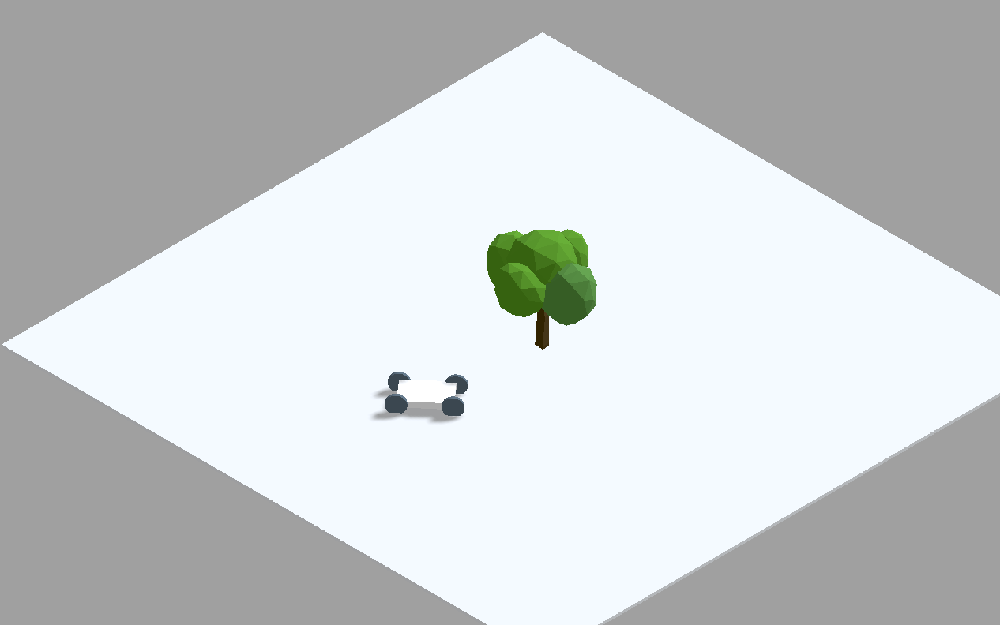

# web-sim-racing
Mini racing game that runs on browser.

## How to run?
1. Have this install to simulate server (otherwise, the browser doesn't allow loading multiple non-built js files -- if only i understand correctly)

        npm install http-server -g
1. Run the server

        http-server . -p 8000
1. Open your browser on incognito tab. A normal web browser tab would cache everything and you would need ctrl+shift+R anytime you want to reload.
1. Car control using key W, A, S, D on the keyboard
1. Modify code in **main.js**

## Development progress
- To do
- 22/7/2020 
    - Setup development server to allow javascript 'import' keyword
    - Load .gltf model and cast shadow

    
- 21/7/2020
    - Model car accelation / steering control using bicycle model
    - Cast the shadow on the floor

## Tip and Tricks
- These 2 lines make things beautiful

        renderer.gammaOutput = true
        renderer.gammaFactor = 2.2